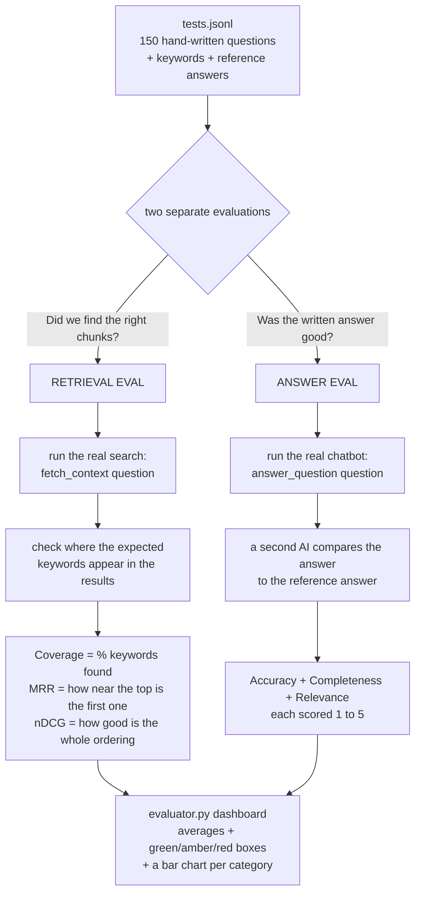

# Week 5 — Evaluating a RAG System (study notes)

These notes assume you've never seen this project. The goal: by the end you
understand *what* a RAG system is, *why* you'd want to measure it, and *how* the
code in `evaluation/` and `evaluator.py` actually does the measuring. Every term
is defined the first time it shows up, and there's a glossary at the bottom.

---

## 1. What are we even building?

We built a chatbot that answers questions about a fictional company, **Insurellm**,
using the company's own documents (employee profiles, contracts, product pages).

The chatbot uses a technique called **RAG — Retrieval-Augmented Generation**.
That name is just three ideas glued together:

- **Retrieval** = go *find* the relevant snippets from your documents.
- **Augmented** = *add* those snippets to the question.
- **Generation** = let the AI *write* an answer using them.

So instead of the AI answering from its own memory (where it might make things
up), it first looks up the real documents, then answers based on what it found.
Like an open-book exam instead of a closed-book one.

**These notes are not about building that chatbot — they're about answering one
question: _is it any good?_** That's what "evaluation" means.

---

## 2. A 60-second recap of how the chatbot works

You need a rough mental model of the chatbot before the evaluation makes sense.
Here's the whole thing in plain language (the details live in
[`PIPELINE.md`](./PIPELINE.md)):

1. **Documents get split into chunks.** A "chunk" is just a small piece of a
   document — a paragraph or two. Big documents are too large to handle whole, so
   we cut them up.
2. **Each chunk is turned into an _embedding_.** An embedding is a list of numbers
   that captures the *meaning* of the text. Texts about similar things get similar
   numbers. (You don't compute these by hand — an AI model does it.)
3. **The embeddings are stored in a _vector database_.** Think of it as a search
   engine that finds text by *meaning* instead of by exact words. (This project
   uses one called Chroma.)
4. **When you ask a question**, the question is also turned into an embedding, and
   the database returns the chunks whose embeddings are *closest* to it — i.e.
   the most relevant snippets.
5. **Those chunks are pasted into a prompt** along with your question, and the AI
   writes the final answer.

That step 4 — "find the closest chunks" — is **retrieval**. Step 5 — "write the
answer" — is **generation**. Remember those two words; the whole evaluation is
built around them.

---

## 3. The one big idea: two things can go wrong, so measure them separately

When the chatbot gives a bad answer, there are **two completely different
reasons** it could have happened:

- **Retrieval failed.** The database handed over the wrong snippets, so the right
  information was never even in front of the AI. No amount of clever prompting
  fixes this — you have to fix the search.
- **Generation failed.** The right snippets *were* there, but the AI still wrote
  a wrong, incomplete, or rambling answer. Here the search is fine — you fix the
  prompt or use a better model.

From the outside both look like "bad answer," but the fixes are opposite. **So we
measure them separately.** This is the single most important idea in this whole
file, and it's why the evaluation code has two independent halves:

- **Retrieval evaluation** → did we find the right chunks?
- **Answer evaluation** → given the chunks, was the written answer good?

Everything below is one or the other.

---

## 4. First you need an answer key — `evaluation/tests.jsonl`

You can't grade an exam without knowing the right answers. So someone wrote out
**150 test questions by hand**, each paired with what a good response should
contain. That file is `tests.jsonl`.

> **What's a `.jsonl` file?** "JSON Lines." It's a text file where *each line* is
> one self-contained JSON record. One question per line. Easy to read one at a
> time, easy to add more.

Each line has four fields. Here's a real one, formatted for readability:

```json
{
  "question": "Who won the prestigious IIOTY award in 2023?",
  "keywords": ["Maxine", "Thompson", "IIOTY"],
  "reference_answer": "Maxine Thompson won the prestigious Insurellm Innovator of the Year (IIOTY) award in 2023.",
  "category": "direct_fact"
}
```

What each field is *for*:

| Field              | What it is                                  | Which half of evaluation uses it |
|--------------------|---------------------------------------------|----------------------------------|
| `question`         | what we'll ask the chatbot                   | both                             |
| `keywords`         | words that the *retrieved chunks* should contain | **retrieval** eval          |
| `reference_answer` | the "model answer" — what a perfect reply looks like | **answer** eval         |
| `category`         | a label like `direct_fact` or `temporal`     | grouping the results, not scoring |

The clever part is the split: **keywords** are a cheap way to check retrieval (if
the chunks we found contain "Maxine", "Thompson", and "IIOTY", we probably found
the right document), while the **reference answer** is what we compare the
chatbot's actual prose against.

`category` is *only* used to group results into buckets so we can see, e.g.,
"we're great at simple facts but weak at questions that span multiple documents."
The 150 questions break down like this:

| Category       | Count | What kind of question it is                          |
|----------------|-------|------------------------------------------------------|
| `direct_fact`  | 70    | a single lookup ("when was the company founded?")    |
| `temporal`     | 20    | about dates or timelines                             |
| `spanning`     | 20    | the answer needs facts from several documents at once |
| `comparative`  | 10    | compare two things                                   |
| `numerical`    | 10    | numbers, counts, money                               |
| `relationship` | 10    | who-reports-to-whom, how entities connect            |
| `holistic`     | 10    | broad, summarize-everything questions                |

Notice 70 of 150 are easy `direct_fact` lookups. That matters later: a great
*overall* score can be hiding a weak `spanning` or `holistic` score, because the
easy questions dominate the average.

**The code that reads this file** (`evaluation/test.py`) is tiny: `load_tests()`
reads the file line by line and turns each line into a `TestQuestion` object. A
`TestQuestion` is just a typed container for those four fields (built with
**Pydantic**, a library that checks the data has the right shape and complains if
a line is malformed).

---

## 5. Half one — measuring retrieval (did we find the right snippets?)

All the retrieval metrics start the same way: take a test question, run the *real*
search, and look at the list of chunks it returns. In code that's one line:

```python
retrieved_docs = fetch_context(test.question)   # the real search, returns a ranked list of chunks
```

`fetch_context` is the project's actual retrieval function — the same one the live
chatbot uses. It returns the chunks **in ranked order**: position 1 is what the
system thinks is most relevant, position 2 second, and so on.

Now the question becomes: **where in that list do the expected keywords appear?**
"Appear" here means a simple **case-insensitive substring match** — is the keyword
literally somewhere in the chunk's text? Crude, but free and unambiguous.

From that one idea we build three metrics, each more demanding than the last.

### 5a. Keyword coverage — "did the keywords show up *at all*?"

The simplest possible check. Of all the keywords we expected, what fraction
appeared *anywhere* in the retrieved chunks? Position doesn't matter — just
present or absent.

```python
keywords_found = sum(1 for kw in test.keywords if kw appears in any retrieved chunk)
keyword_coverage = keywords_found / total_keywords * 100   # a percentage
```

If a test expects 3 keywords and we found 2 of them somewhere, coverage = 66.7%.
This tells you "did the search even get into the right neighborhood?"

### 5b. MRR — "okay, but were they near the *top* of the list?"

Coverage doesn't care whether the right chunk was #1 or #20. But it *should*
matter, because only the top few chunks get pasted into the AI's prompt — a
great chunk buried at position 18 might never be used.

**MRR (Mean Reciprocal Rank)** rewards finding things early. For one keyword: find
the position of the *first* chunk containing it, and score `1 / position`.

```python
def calculate_mrr(keyword, retrieved_docs):
    for rank, doc in enumerate(retrieved_docs, start=1):   # rank counts 1, 2, 3, ...
        if keyword.lower() in doc.page_content.lower():
            return 1.0 / rank          # found at position 3 → score 1/3
    return 0.0                          # never found → 0
```

The `1 / position` ("reciprocal rank") drops off fast, which is the point:

| First match at position | Score (1/position) |
|-------------------------|--------------------|
| 1                       | 1.000              |
| 2                       | 0.500              |
| 3                       | 0.333              |
| 5                       | 0.200              |
| 10                      | 0.100              |
| not found at all        | 0.000              |

A test usually has several keywords, so the test's MRR is the **average** of each
keyword's reciprocal rank. The dashboard then averages across all 150 tests.
"Mean" reciprocal rank = the averaging.

### 5c. nDCG — "was the *whole ordering* good?"

MRR only looks at the *first* match for each keyword. But a keyword might appear
in several chunks, and we'd like *all* the relevant chunks to be near the top, not
just the first one. **nDCG** grades the entire top-of-the-list ordering.

It's built in three small steps. Don't be scared by the name — it's just
"reward relevant chunks, but discount the ones lower down, then compare to the
best you could have done."

**Step 1 — write down what's relevant, as 1s and 0s.** For the top 10 chunks, put
a 1 where the keyword appears and a 0 where it doesn't:

```
relevances = [0, 1, 0, 0, 1, 0, 0, 0, 0, 0]
#                ↑        ↑
#          keyword found at positions 2 and 5
```

**Step 2 — DCG (Discounted Cumulative Gain): add up the 1s, but worth less the
lower they are.** Each hit is divided by `log2(position + 1)`, which grows as you
go down the list — so a hit lower down contributes a smaller number. That's the
"discount."

```python
def calculate_dcg(relevances, k):
    return sum(relevances[i] / math.log2(i + 2) for i in range(k))
    #                                       └─ i starts at 0, so position = i+1,
    #                                          and log2(position+1) = log2(i+2)
```

**Step 3 — normalize: divide by the best score possible (IDCG).** A raw DCG
number is hard to interpret. So we compute the DCG of the *ideal* ordering — same
hits, but all pushed to the very top — and divide by it. That's **IDCG** (the "I"
is for "Ideal"). The result, **nDCG** (the "n" is "normalized"), always lands
between 0 and 1, where 1 means "perfectly ordered."

```python
nDCG = DCG / IDCG     # always 0 to 1; 1 = couldn't have ordered it any better
```

**Worked example** with our `[0,1,0,0,1,0,...]` (hits at positions 2 and 5):

- **DCG** = 1/log₂(3) + 1/log₂(6) = 0.631 + 0.387 = **1.018**
  *(the two hits, at positions 2 and 5, each discounted)*
- **IDCG** = 1/log₂(2) + 1/log₂(3) = 1.000 + 0.631 = **1.631**
  *(the same two hits, but imagined at positions 1 and 2 — the best case)*
- **nDCG** = 1.018 / 1.631 = **0.624**

Sanity check the intuition: if those two hits had actually been at positions 1 and
2, DCG would equal IDCG and nDCG = **1.0** (perfect). If they were way down at
positions 9 and 10, nDCG would drop toward 0. So nDCG literally measures "how
close to the best-possible ordering were we?"

### The three together

They answer increasingly demanding questions, and you read them as a set:

- **Coverage:** were the right things found *at all*?
- **MRR:** was the *first* right thing near the top?
- **nDCG:** was the *whole list* well-ordered?

All three are bundled into a `RetrievalEval` object by the function
`evaluate_retrieval(test)`.

---

## 6. Half two — measuring the answer (was the written answer good?)

Math can check whether the right chunks were retrieved, but it can't judge whether
a *paragraph of prose* is accurate and well-written. For that we use a trick
called **LLM-as-a-judge**: we ask *another* AI to grade the answer.

> **LLM** = Large Language Model, i.e. the AI itself. "LLM-as-a-judge" just means
> "use an AI to score the output of an AI." Like having a second teacher grade the
> essay against the official answer key.

The process (in `evaluate_answer`):

1. **Get the chatbot's real answer.** Run the full pipeline:
   `answer = answer_question(test.question)`.
2. **Hand the judge three things:** the original question, the chatbot's answer,
   and the `reference_answer` (the model answer from our test file).
3. **Ask the judge to score three things, each from 1 to 5:**

| Dimension        | The question it asks                                  | What loses points                                  |
|------------------|------------------------------------------------------|----------------------------------------------------|
| **Accuracy**     | Is what it said *true* (vs. the reference)?           | Any factual error forces a 1 — you can't be "half right" on a fact |
| **Completeness** | Did it include *everything* the reference covers?     | Correct but thin answers score high accuracy, low completeness |
| **Relevance**    | Did it answer the question *and nothing else*?        | Padding with extra unasked-for info costs points even if true |

These are deliberately separate because an answer can be, say, perfectly accurate
but incomplete, or complete but full of irrelevant rambling.

**How the score comes back cleanly.** We don't want the judge to reply with chatty
prose like "I'd give this about a 4 on accuracy..." that we then have to parse.
Instead we use **structured output**: we hand the AI a form to fill in (defined as
a Pydantic model called `AnswerEval`) and the AI is forced to return data in
exactly that shape — a number for `accuracy`, a number for `completeness`, etc.,
plus a short text `feedback`. No fragile text-scraping.

The prompt also includes explicit anti-leniency rules — "only give 5/5 for a
perfect answer," "if the answer is wrong, accuracy *must* be 1" — because AI
judges, left alone, tend to be generous and hand out 5s too easily.

> **One honest caveat to remember:** in this project the chatbot and the judge are
> the *same* underlying model. A model grading its own family's work tends to go
> easy. So treat the absolute scores with a pinch of salt — they're most useful
> for spotting whether a change made things *better or worse over time*, not as a
> universal truth.

---

## 7. Running it all — the dashboard (`evaluator.py`) and the CLI

The two halves above are the *logic*. `evaluator.py` is just a friendly **web page**
(built with Gradio, a Python UI library) to run them and look at results.

It has two buttons — one for retrieval, one for answers. Click one and it:

1. Runs that evaluation across **all 150 tests** (with a progress bar).
2. Shows the **average** of each metric in a big colored box.
3. Draws a **bar chart** breaking the score down **by category**.

**The colors are traffic lights** — green = healthy, amber = okay, red = problem —
so you can read the health at a glance. The cutoffs (`get_color`):

| Metric                          | 🟢 Green | 🟠 Amber | 🔴 Red  |
|---------------------------------|---------|---------|--------|
| MRR                             | ≥ 0.90  | ≥ 0.75  | < 0.75 |
| nDCG                            | ≥ 0.90  | ≥ 0.75  | < 0.75 |
| Keyword coverage                | ≥ 90%   | ≥ 75%   | < 75%  |
| Accuracy / Completeness / Relevance (1–5) | ≥ 4.5 | ≥ 4.0 | < 4.0 |

**Why the per-category bar chart matters:** remember 70 of 150 questions are easy
`direct_fact` lookups. If you only looked at the overall average, those easy wins
would mask a weakness in, say, `spanning` questions. The chart splits the score
per category so weak spots can't hide behind the average.

**One technical detail worth knowing** about how the results stream in: the
functions `evaluate_all_retrieval()` and `evaluate_all_answers()` are Python
**generators** — instead of computing all 150 results and returning them in one
lump (which would freeze the page), they `yield` one result at a time. That's what
lets the progress bar tick forward live.

**There's also a terminal version.** `evaluation/eval.py` can be run directly to
evaluate a *single* test from the command line:

```
uv run eval.py 0      # runs both evals on test #0 and prints everything
```

It prints the question, the keywords, the retrieval scores, the chatbot's actual
answer, the judge's written feedback, and the three answer scores. This is the
fast way to debug one specific question instead of waiting for all 150.

---

## 8. How it all fits together



The important thing this picture shows: **both evaluations run the *real* chatbot
code** (`fetch_context`, `answer_question`). We're grading the actual system that
ships, not a separate copy that might behave differently.

---

## 9. Glossary (every term, in one line each)

- **RAG (Retrieval-Augmented Generation)** — answer questions by first *finding*
  relevant document snippets, then having the AI write an answer using them.
- **Chunk** — a small piece of a document (a paragraph or two) that we search over.
- **Embedding** — a list of numbers representing the *meaning* of a piece of text;
  similar meanings → similar numbers.
- **Vector database** — a store that finds text by meaning (closeness of
  embeddings) rather than by exact word match. (Here: Chroma.)
- **Retrieval** — the step that finds the relevant chunks for a question.
- **Generation** — the step where the AI writes the final answer.
- **LLM (Large Language Model)** — the AI model itself.
- **LLM-as-a-judge** — using one AI to grade the output of another AI.
- **Reference answer** — the hand-written "model answer" we grade against.
- **Keyword (in this project)** — a word we expect to see in the *retrieved
  chunks*; used as a cheap check that retrieval worked.
- **MRR (Mean Reciprocal Rank)** — average of `1/position` of the first relevant
  hit; rewards finding the right thing near the top.
- **DCG (Discounted Cumulative Gain)** — sum of relevant hits, each worth less the
  lower it sits in the list.
- **IDCG (Ideal DCG)** — the DCG of the best-possible ordering (all hits on top).
- **nDCG (normalized DCG)** — `DCG / IDCG`, a 0–1 score for how good the ordering
  was (1 = couldn't be better).
- **Keyword coverage** — the percentage of expected keywords found anywhere in the
  retrieved chunks.
- **Structured output** — forcing the AI to reply in a fixed data shape (a filled
  form) instead of free text, so we can read the values reliably.
- **Pydantic** — a Python library that defines those data shapes and validates
  that data matches them.
- **JSONL** — a text file with one JSON record per line.
- **Generator** — a Python function that produces results one at a time (with
  `yield`) instead of all at once, so progress can stream.
- **Gradio** — a Python library for quickly building web UIs (the dashboard).

---

## 10. The five things to remember

1. **RAG = look it up, then answer.** Evaluation asks: is it any good?
2. **Two things can go wrong — bad *retrieval* or bad *generation* — and they
   need opposite fixes, so we measure them separately.**
3. **You need an answer key first.** 150 hand-written questions with expected
   keywords (for retrieval) and reference answers (for the answer judge).
4. **Retrieval metrics build up:** coverage (found at all?) → MRR (found near the
   top?) → nDCG (whole list ordered well?).
5. **Answer quality is graded by another AI** on accuracy, completeness, and
   relevance — convenient, but a little lenient since it's grading its own kind.

---

## Appendix — `answer.py`/`ingest.py` vs `answer2.py`/`ingest2.py`

You may notice two versions of the pipeline files. `answer.py`/`ingest.py` are the
earlier, simpler first attempt; `answer2.py`/`ingest2.py` are the improved
versions that the app and the evaluator actually use. The biggest difference is in
*how documents get chunked*: the v1 version asks the AI to copy each chunk's text
out (which risks the AI subtly altering it), while v2 asks the AI only for the
*line numbers* where each chunk starts and ends, and the code slices the exact
text out of the original file. That guarantees stored chunks are identical to the
source — the AI decides *where* the boundaries are, the code handles the *text*.
Everything in these notes applies to the v2 versions, since those are what's wired
up. See [`PIPELINE.md`](./PIPELINE.md) for the full pipeline walkthrough.
