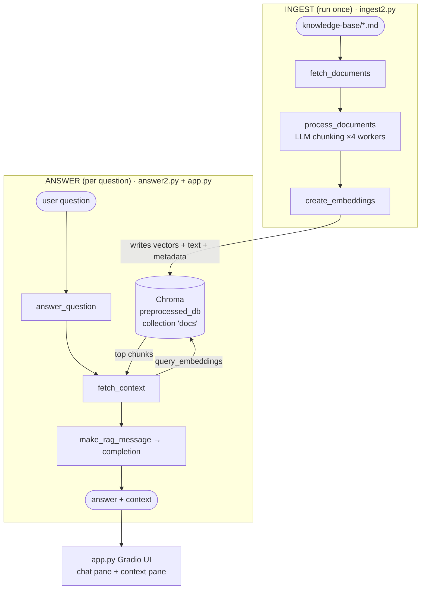
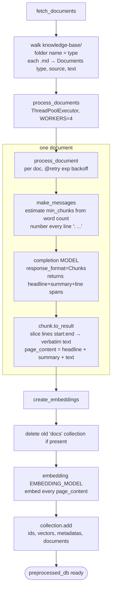
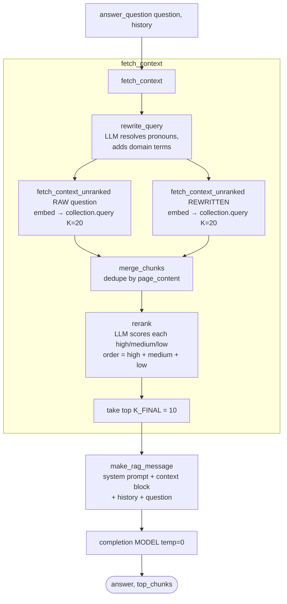

# Week 5 — RAG Knowledge-Base Pipeline (study notes)

How the Insurellm expert assistant turns a folder of Markdown docs into a
searchable vector store, then answers questions against it with query
rewriting, dual retrieval, and LLM reranking. Files involved:

- `pro_implementation/ingest2.py` — **offline builder** (docs → LLM chunking → embeddings → Chroma)
- `pro_implementation/answer2.py` — **online query engine** (rewrite → retrieve → merge → rerank → answer)
- `app.py` — **UI** (Gradio chat that calls `answer_question` and shows the retrieved context)

Two halves, run at different times. `ingest2.py` runs **once** to build
`preprocessed_db/`. `answer2.py` + `app.py` run **per question**, reading that
same store. They only meet at the Chroma collection `"docs"`.

---

## Flowchart 1 — The two halves and where they meet



---

## Flowchart 2 — `ingest2.py`: docs → Chroma

The clever bit: the LLM **never copies text**. It only reports `start_line` /
`end_line` per chunk, and the verbatim content is sliced back out of the source
in code (`Chunk.to_result`). This keeps stored chunks byte-identical to the
source — no paraphrasing, no hallucinated text.



**`make_messages` chunk-count math** — `step = TARGET_WORDS - OVERLAP_WORDS`
(new words each chunk past the first). If the doc fits in one chunk →
`num_chunks = 1`; else `1 + ceil(leftover / step)`. This number is injected as
`min_chunks` so the model knows the floor — guidance, not a hard cut; natural
boundaries still win.

---

## Flowchart 3 — `answer_question`: the retrieve-and-answer gauntlet

Two retrievals run against the store — one on the **raw** question, one on an
LLM-**rewritten** query — then merge, rerank, and trim to `K_FINAL`. Casting a
wider net (two phrasings, `K_RETRIEVAL=20` each) then letting a reranker LLM
pick the best `K_FINAL=10` beats a single vector search.



**`rerank` scoring** — the model returns a `Reranks` JSON (`id`, `score`) for
each chunk; results are bucketed into `high` / `medium` / `low` and
concatenated in that order. The `low` bucket is kept as a fallback tail so
there are always enough chunks to fill `K_FINAL` even if few score high.

---

## Flowchart 4 — `app.py`: the Gradio chat loop

`message.submit` chains two steps with `.then(...)`: first echo the user turn
into the chatbot, then run the RAG call and fill both panes.

```mermaid
flowchart TD
    A([user types + submits]) --> B[put_message_in_chatbot<br/>append user msg, clear textbox]
    B --> C[chat history]
    C --> D[last = history[-1], prior = history[:-1]]
    D --> E[answer_question last, prior]
    E --> F[append assistant msg to history]
    E --> G[format_context<br/>HTML: source headers + chunk text]
    F --> H[chatbot pane updates]
    G --> I[context_markdown pane updates]
```

---

## Key concepts recap

**Line-number chunking (no-copy invariant)** — the chunker LLM reports only
`start_line`/`end_line`; `Chunk.to_result` slices `document.text.splitlines()`
to rebuild verbatim content. The model can't paraphrase or fabricate the stored
text — it only decides *where* the boundaries are. Headlines/summaries it does
write are prepended to aid retrieval, then carried in `page_content`.

**Query rewriting** — `rewrite_query` turns a conversational, pronoun-laden
question into a self-contained, noun-rich search query using the conversation
history and KB-domain vocabulary (Company / Contracts / Employees / Products).
Embeddings match on meaning, so cleaner phrasing → better neighbours.

**Dual retrieval + merge** — the same store is queried with both the raw and
rewritten phrasings; `merge_chunks` dedupes by exact `page_content` so a chunk
found by both phrasings appears once. More recall before the reranker prunes.

**LLM reranking** — a second model pass scores each merged chunk
`high`/`medium`/`low` against the query and reorders, preferring domain match
and specific facts over general summaries. Cheaper than embedding more, sharper
than vector distance alone. Top `K_FINAL` survive into the answer prompt.

**Grounded generation** — `RAG_SYSTEM_PROMPT` injects the surviving chunks
(labelled with type + source) and orders the model to ground every claim in
context, quote specifics, cite sources, and abstain only when nothing relevant
is present. History is included for reference resolution, not as a fact source.

**Offline vs online** — ingestion is expensive and runs once (parallel LLM
chunking + embeddings, with `@retry` exponential backoff against rate limits);
answering is cheap and runs per turn. The Chroma collection `"docs"` in
`preprocessed_db/` is the only handoff — rebuild it by re-running `ingest2.py`,
which drops and recreates the collection each time.

**Pydantic everywhere** — `Documents`/`Chunk`/`Chunks` shape the ingest side,
`Results`/`Metadata`/`Rerank`/`Reranks` shape the query side. Passing
`response_format=Chunks` / `Reranks` to `completion` forces the model to emit
schema-valid JSON, validated via `model_validate_json` — no brittle parsing.
